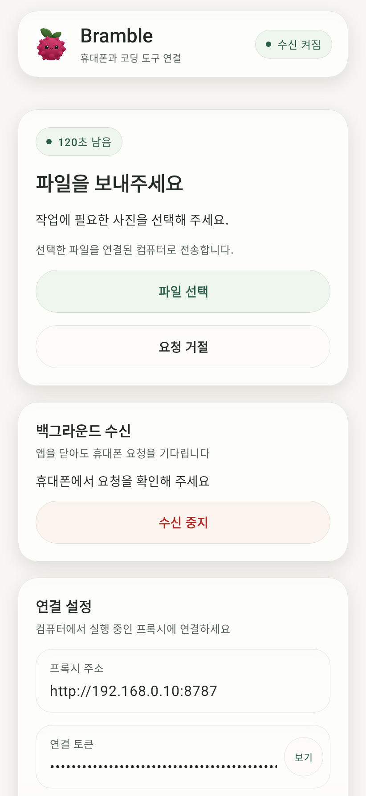
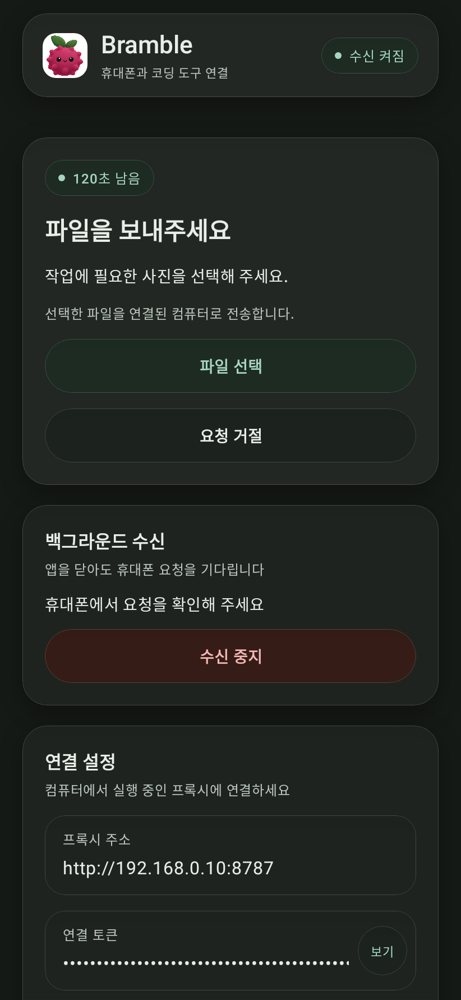

# Bramble

Bramble은 코딩 도구의 MCP 호출을 Android 휴대폰에 전달하는 로컬 릴레이입니다. 현재 제공하는 도구는 두 개입니다.

| MCP 도구 | 휴대폰 동작 | 결과 |
| --- | --- | --- |
| `phone_read_clipboard` | 사용자가 **클립보드 공유**를 누름 | 텍스트를 도구 결과로 반환 |
| `phone_pick_file` | 사용자가 Android 파일 선택기로 파일을 고름 | Go 프록시 호스트에 저장한 파일의 절대 경로를 반환 |

Go 프록시는 요청을 메모리에 보관하고 Android 앱의 긴 폴링 요청에 전달합니다. 사용자가 수신을 켜면 `connectedDevice` 포그라운드 서비스가 앱 화면을 닫은 뒤에도 연결을 유지하고 요청 알림을 표시합니다. 알림을 눌러 앱에서 자료를 공유하거나 요청을 거절합니다. 이 설정은 재부팅과 앱 업데이트 후에도 복원됩니다. 요청은 2분 후 만료되고 서버를 재시작하면 대기 요청이 사라집니다.

## 빌드

- Go 1.23 이상: `go build -o bramble ./cmd/bramble`
- Android: JDK 21, Android SDK 37.0과 Build Tools 36.0.0을 설치한 다음 `./gradlew :app:assembleDebug`
- 디버그 APK: `app/build/outputs/apk/debug/app-debug.apk`

UI는 [Hoard Liquid Glass 기록](https://github.com/sleepysoong/hoard/blob/main/LIQUID_GLASS.md)의 Backdrop 2.0.1, 배경 기록과 소비자 분리, 세 톤의 공통 재질, 헤어라인 림, 다크 테마 규칙을 따릅니다. 고정 상단 바·상태 배지·입력창·버튼·테마 선택에 공통 재질을 적용하고, 테마 선택 캡슐은 라벨을 별도 레이어에 기록해 굴절시킵니다. 누름·해제·선택 이동은 공통 스프링을 사용합니다.

Compose의 native 렌더링 회귀 테스트는 `app/build/test-artifacts/glass/`에 스크린샷을 저장합니다. 앱과 기기 테마가 다른 경우의 글자 대비, 작은 화면과 큰 글꼴, 고정 상단 바, 선택 캡슐 이동을 검사합니다. 코드 전체 검토와 수정 근거는 [REVIEW.md](REVIEW.md)에 정리합니다.

아래는 Robolectric native 렌더링으로 생성한 앱 화면입니다. 실기기 촬영은 아닙니다. 설정 화면은 [라이트](docs/screenshots/light-settings.png)·[다크](docs/screenshots/dark-settings.png)에서 확인할 수 있습니다.

| 라이트 | 다크 |
| --- | --- |
|  |  |

## 연결

1. 호스트에서 `./bramble token`을 실행해 토큰을 생성합니다. 토큰은 개인 비밀 저장소에 보관합니다.
2. 호스트에서 아래와 같이 같은 토큰으로 서버를 엽니다. 방화벽에서 휴대폰의 접근만 허용하세요. 기본 주소 `127.0.0.1:8787`은 호스트 내부 전용입니다.

   ```bash
   export BRAMBLE_TOKEN='발급받은 토큰'
   export BRAMBLE_SERVER='http://127.0.0.1:8787'
   ./bramble serve -listen 0.0.0.0:8787 -data "$HOME/bramble-uploads"
   ```

3. APK를 설치하고 앱에 `http://<호스트 LAN IP>:8787`과 같은 토큰을 입력한 뒤 **저장하고 수신 시작**을 누릅니다. 요청 알림 권한을 허용합니다. 수신 중에는 지속 알림이 표시되고 알림이나 앱 화면에서 중지할 수 있습니다. Android 에뮬레이터에서 호스트는 `http://10.0.2.2:8787`입니다.
4. 코딩 도구가 실행되는 호스트에서 `BRAMBLE_TOKEN`과 `BRAMBLE_SERVER` 환경 변수를 설정하고 MCP stdio 서버를 등록합니다.

Codex CLI의 `~/.codex/config.toml` 예시입니다. 실행 파일 경로를 실제 절대 경로로 바꾸고, Codex를 시작할 때 `BRAMBLE_TOKEN`을 환경 변수로 전달하세요. 휴대폰에서 응답할 시간을 위해 도구 제한 시간을 130초로 설정합니다. 이 설정 형식은 [OpenAI Docs의 Codex MCP 문서](https://learn.chatgpt.com/docs/extend/mcp?surface=cli)를 따릅니다.

```toml
[mcp_servers.bramble]
command = "/absolute/path/to/bramble"
args = ["mcp"]
env_vars = ["BRAMBLE_TOKEN", "BRAMBLE_SERVER"]
tool_timeout_sec = 130
```

설정 후 `codex mcp list`로 등록을 확인합니다. 다른 MCP stdio 호스트에서도 같은 실행 파일에 `mcp` 인자를 주면 됩니다. MCP 전송은 줄 단위 JSON-RPC이며 `initialize`, `ping`, `tools/list`, `tools/call`, `notifications/cancelled`를 지원합니다. 코딩 도구에서 요청을 취소하거나 MCP 입력을 닫으면 프록시의 대기 요청도 종료합니다. 최신 앱은 진행 중인 요청 상태를 3초마다 확인해 취소된 요청의 알림을 정리합니다. 앱과 프록시를 함께 업데이트하면 이 동작을 사용할 수 있습니다. 상태 조회를 지원하지 않는 구형 프록시에서는 기존 2분 만료를 사용합니다.

## 데이터와 네트워크

- 모든 HTTP 경로에 Bearer 토큰을 요구합니다. 기본 바인드는 localhost입니다. 브라우저 `Origin` 요청은 거절합니다.
- LAN의 일반 HTTP는 암호화되지 않습니다. 신뢰할 수 있는 LAN에서만 쓰거나 프록시 앞에 HTTPS를 구성하세요. 토큰을 인터넷에 노출하지 마세요.
- 클립보드 텍스트는 서버 메모리에서만 처리하며 UTF8 기준 최대 1 MiB입니다. 파일은 `-data` 디렉터리에 0600 권한으로 저장하고 자동 삭제하지 않습니다. 파일 크기 한도는 20 MiB이며 앱과 서버 모두 실제 스트림에 한도를 적용합니다. 한글 파일명은 UTF8 인코딩 헤더로 전달하고, 저장 파일명에는 요청 ID가 붙습니다.
- 토큰은 Android 앱의 비공개 설정 저장소에 보관됩니다. 연결 토큰과 수신 설정은 Android 클라우드 백업 및 기기 간 전송에서 제외되므로 새 기기에서 다시 연결해야 합니다. 이 초기 버전은 한 토큰을 앱과 MCP 양쪽에 사용하므로 토큰을 공유하면 모든 작업에 접근할 수 있습니다.
- Android의 절전 모드(Doze)는 포그라운드 서비스의 네트워크도 지연시킬 수 있습니다. 즉시 수신이 필요하면 앱의 **배터리 설정 열기**에서 Bramble을 최적화 예외로 지정하세요. 사용자가 서비스를 중지하거나 앱을 강제 종료한 경우 자동 수신은 중단될 수 있습니다.

## 릴리스 CI

`main` 푸시마다 Go 정적 검사와 경쟁 상태 테스트, Android 단위 테스트와 Lint를 실행합니다. 검사에 통과하면 `version.properties`의 패치 버전을 올리고 Linux amd64/arm64 바이너리와 서명된 APK를 만들어 GitHub Release를 게시합니다. MCP 버전 응답에도 릴리스 버전을 주입합니다. APK 서명을 확인하며 릴리스에는 각 파일의 `SHA256SUMS`도 포함합니다. Android 스크린샷과 HTML 테스트 결과는 `android-review-<run_id>` 아티팩트로 7일간 보관합니다.

버전 커밋과 태그는 한 번에 푸시하여 빌드한 소스와 릴리스 태그를 일치시킵니다. 빌드 중 `main`에 다른 변경이 들어오면 해당 릴리스 푸시는 실패하며 다음 실행에서 최신 소스를 다시 빌드합니다. CI에는 `BRAMBLE_KEYSTORE_B64`, `BRAMBLE_KEYSTORE_PASSWORD`, `BRAMBLE_KEY_ALIAS`, `BRAMBLE_KEY_PASSWORD` 저장소 secret이 필요합니다. 키 파일은 Git에 넣지 않습니다.

릴리스 파일을 한 디렉터리에 다운로드한 뒤 `sha256sum -c SHA256SUMS`로 무결성을 확인할 수 있습니다. 로컬 코드 검사는 `go vet ./...`, `go test -race ./...`, `./gradlew :app:testDebugUnitTest :app:lintDebug`로 실행합니다.
